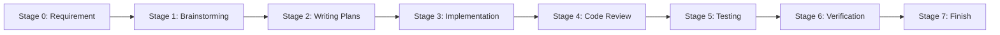
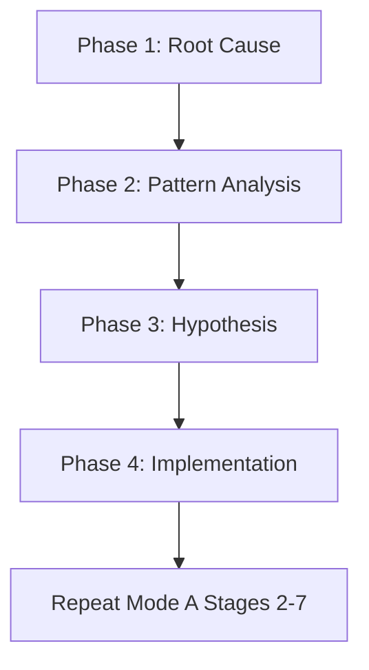

# DevFlow Skill

Universal development workflow for AI-assisted software development.

## Quick Start

```yaml
Q1: Did you read "using-superpowers" skill?
   NO → Read it NOW before anything else
   YES → Continue to Q2

Q2: Is there an approved requirement?
   NO → Create/Check Requirement first (use CLI: devflow req list)
   YES → Continue to Q3

Q3: What type of work is this?
   Bug/Fix/Error → MODE B (Debug)
   Add/Create/Build → MODE A (Feature)
   Unclear → Ask user to clarify

Q4: Are you stuck?
   YES → Check docs/WORKFLOW_TROUBLESHOOTING.md or ask human
   NO → Follow mode workflow below
```

## MODE A: Feature Development (8 Stages)



### Stage 0: Requirement

**CLI**: `devflow req list` → `devflow req new REQ-001`

**Purpose**: Ensure approved requirement exists before development

**Process**:
1. Check existing requirements: `devflow req list`
2. If none, create: `devflow req new REQ-001 --title "Feature Name"`
3. Edit `docs/requirements/REQ-001.md` - fill in description and acceptance criteria
4. Run Stage 1 (Brainstorming) as analysis
5. Propose 2-3 design approaches
6. Get user confirmation → Update requirement with final design
7. Approve: `devflow req status REQ-001 approved`

**Gate**: Do NOT proceed until requirement is APPROVED

### Stage 1: Brainstorming

**Skill**: `brainstorming` | **Output**: `docs/superpowers/specs/YYYY-MM-DD-<feature>-design.md`

**Now**: Explore context → Ask questions → Propose approaches → Write design doc

**Process**:
1. Read `brainstorming` skill
2. Explore project context (read AGENTS.md, existing code)
3. Ask clarifying questions ONE AT A TIME
4. Propose 2-3 approaches with trade-offs
5. Present design for user approval
6. Write design doc
7. Self-review (no TBD/TODO)
8. **Gate**: User must approve

### Stage 2: Writing Plans

**Skill**: `writing-plans` | **Output**: `docs/superpowers/plans/YYYY-MM-DD-<feature>-plan.md`

**Now**: Check scope → Design structure → Decompose tasks → Write plan

**Process**:
1. Read `writing-plans` skill
2. Check scope (break into separate plans if needed)
3. Design file structure
4. Decompose into bite-sized tasks (2-5 min each)
5. Write plan with exact file paths and code
6. Self-review (spec coverage, no placeholders)

**Forbidden**: TBD, TODO, "implement later", "similar to Task N"

### Stage 3: Implementation

**Skills**: `test-driven-development` + `subagent-driven-development`

**Now**: TDD cycle → Subagent per task → Spec review → Code quality review

**TDD Cycle**:
```
RED (failing test) → GREEN (minimal code) → REFACTOR (keep green)
```

**Iron Law**: NO production code without failing test first

**Subagent per Task**:
1. Dispatch implementer with full context
2. Answer questions
3. Subagent implements/tests/commits
4. Dispatch spec reviewer
5. IF issues: fix and re-review
6. Dispatch code quality reviewer
7. IF issues: fix and re-review
8. Mark complete

### Stage 4: Code Review

**Skill**: `requesting-code-review`

**Now**: Get SHAs → Dispatch reviewer → Process feedback

**Process**:
1. Read `requesting-code-review` skill
2. Get SHAs: `BASE_SHA=$(git rev-parse HEAD~1)`, `HEAD_SHA=$(git rev-parse HEAD)`
3. Dispatch code-reviewer
4. Process feedback:
   - 🔴 Critical: Fix immediately
   - 🟡 Important: Fix before proceeding
   - 🟢 Minor: Log for later

### Stage 5: Testing

**Run all tests** (check `devflow.toml` for project commands):

```bash
{{ commands.test }}
{{ commands.test_unit }}
{{ commands.test_integration }}
```

**Check project constraints** from AGENTS.md:
- Build with 0 warnings?
- All tests pass?
- No regressions?

### Stage 6: Verification

**Skill**: `verification-before-completion`

**Process**:
1. IDENTIFY: What command proves the claim?
2. RUN: Execute command fresh
3. READ: Full output, check exit code
4. VERIFY: Does output confirm?
5. CLAIM: Make claim WITH evidence

**Forbidden**: "Should work", "Probably passes", "Seems correct"

### Stage 7: Finish

**Skill**: `finishing-a-development-branch`

**Now**: Verify tests → Present options → Execute → Cleanup

**Process**:
1. Read `finishing-a-development-branch` skill
2. Verify tests pass
3. Present options:
   - 1. Merge locally
   - 2. Push and create PR
   - 3. Keep branch as-is
   - 4. Discard work
4. Execute chosen option
5. Cleanup worktree (options 1 & 4)

Update requirement: `devflow req status REQ-001 done`

---

## MODE B: Debug (4 Phases)

**Skill**: `systematic-debugging`



### Phase 1: Root Cause Investigation

**Before any fix**:
- Read error messages (stack traces, line numbers)
- Reproduce consistently
- Check recent changes (git diff)
- Gather evidence at component boundaries
- Trace data flow to source

**Completion**: Understand WHAT and WHY

### Phase 2: Pattern Analysis

- Find working examples
- Read reference implementation COMPLETELY
- List ALL differences
- Identify dependencies

### Phase 3: Hypothesis & Testing

- Form single hypothesis: "X is root cause because Y"
- Test minimally (one variable)
- Verify: Works → Phase 4; Fails → New hypothesis

### Phase 4: Implementation

- Create failing test (use TDD skill)
- Implement single fix (root cause only)
- Verify: test passes, no regression
- IF fails: <3 attempts → Phase 1; ≥3 → Phase 4.5

### Phase 4.5: Question Architecture

**Activate**: 3+ fix attempts failed

**STOP and discuss with human**:
- Is pattern fundamentally sound?
- Should we refactor vs fix symptoms?

### Post-Debug

**MUST repeat Mode A Stages 2-7** (plan → implement → review → test → verify → finish)

---

## 5 IRON LAWS

| # | Law | Status | If Violated |
|---|-----|--------|-------------|
| 1 | Read `using-superpowers` first | 🔴 Rigid | Stop, read skill |
| 2 | TDD: Test before code | 🔴 Rigid | Delete code, restart |
| 3 | Verify before claim | 🔴 Rigid | Run test → Read → Claim |
| 4 | Root cause before fix | 🟡 Strong | Ask human after 3 fails |
| 5 | Debug → Repeat stages 2-7 | 🟡 Strong | Full cycle before commit |

---

## CLI Reference

```bash
# Initialize project
devflow init --language python --name "My Project"

# Requirements
devflow req list                    # List all requirements
devflow req new REQ-001 --title "Feature"   # Create requirement
devflow req show REQ-001            # Show details
devflow req status REQ-001 approved # Update status

# Tasks
devflow task list                   # List all tasks
devflow task new -r REQ-001 -t "Implement"  # Create task
devflow task done TASK-001          # Mark done

# Status & Validation
devflow status                      # Project overview
devflow validate                    # Check compliance
```

---

## Document Structure

```
project/
├── .devflow/
│   ├── config.toml          # Project configuration
│   └── state.toml           # Task state
├── docs/
│   ├── WORKFLOW.md          # This workflow (copy)
│   ├── REQUIREMENTS.md      # Requirements guide
│   ├── requirements/        # Requirement files
│   │   ├── TEMPLATE.md
│   │   ├── REQ-001.md
│   │   └── REQ-002.md
│   └── superpowers/         # Design docs & plans
│       ├── specs/
│       └── plans/
├── AGENTS.md                # Project context
└── {{ paths.src }}/         # Source code
```

---

*DevFlow Universal Workflow v1.0*
