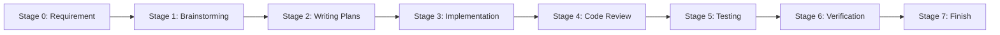
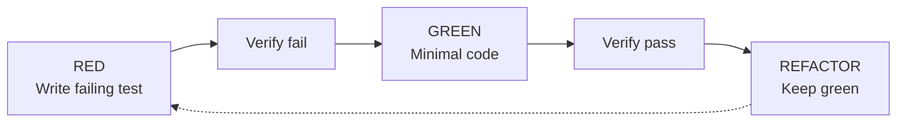
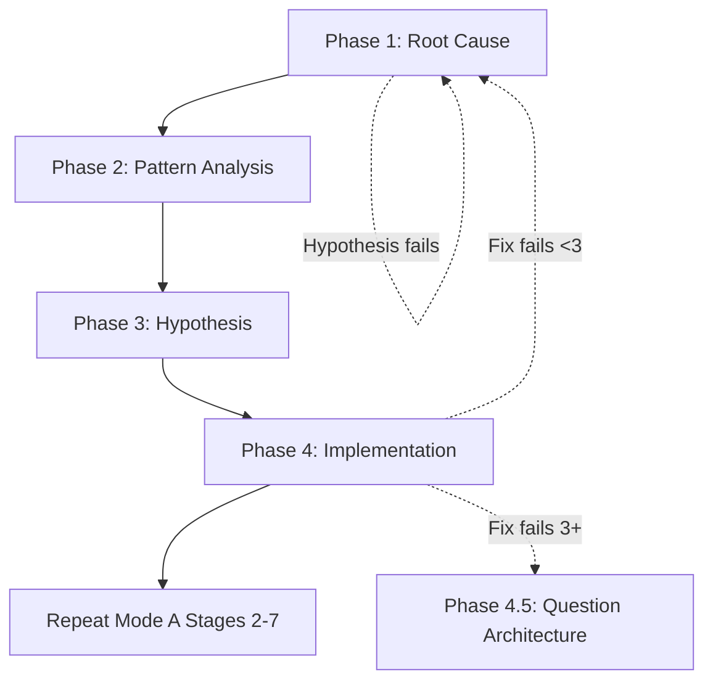

# AI Agent Development Workflow

> **Quick Links**: [Requirements](docs/REQUIREMENTS.md) | [AGENTS.md](AGENTS.md) | [DevFlow CLI](.devflow/README.md)

---

## DevFlow CLI

**Use [DevFlow CLI](CLI.md) to manage requirements, features, and workflow stages.**

All requirements and features MUST be tracked via the CLI.

Quick reference:

```bash
# Initialize project
devflow init --language {{ project.language }} --name "{{ project.name }}"

# Requirements → Features → Tasks
devflow req new REQ-001 --title "Core System"
devflow feat new FEAT-001 -r REQ-001 -t "Database Module"
devflow task new -r REQ-001 -t "Setup DB"

# Status
devflow status
devflow validate
```

See [CLI.md](CLI.md) for complete command reference.

---

## START HERE: 3 Questions

```yaml
Q1: Did you read "using-superpowers" skill?
   NO → Read it NOW before anything else
   YES → Continue to Q2

Q2: Is there an approved requirement?
   NO → Create/Check [Requirement](docs/REQUIREMENTS.md) first
   YES → Continue to Q3

Q3: What type of work is this?
   Bug/Fix/Error → MODE B (Debug)
   Add/Create/Build → MODE A (Feature)
   Unclear → Ask user to clarify

Q4: Are you stuck?
   YES → Ask human for guidance
   NO → Follow mode workflow below
```

---

## MODE A: Feature Development (8 Stages)



### Stage 0: Requirement (Prerequisite)

**Document**: [REQUIREMENTS.md](docs/REQUIREMENTS.md)

**Purpose**: Capture, analyze, and approve requirements before development

**Now**: Check requirement exists → Create if needed → Ensure approved

<details>
<summary>📖 Details</summary>

**Requirement States**: DRAFT → ANALYZING → ANALYZED → APPROVED → IN_PROGRESS → DONE

**Process**:
1. Check `docs/requirements/` for existing REQ
2. If not exists: Create from [TEMPLATE](docs/requirements/TEMPLATE.md)
3. Run **Stage 1 (Brainstorming)** as requirement analysis
4. Propose 2-3 design approaches with trade-offs
5. **Get user feedback** → Refine design based on feedback
6. **Update requirement document** with final confirmed design
7. **Get explicit user confirmation** on final design → Status: APPROVED
8. Proceed to Stage 2 (Writing Plans)

**IMPORTANT**: Do NOT proceed to Stage 2 until:
- [ ] User has confirmed the final design
- [ ] Requirement document is updated with confirmed design details
- [ ] Status is set to APPROVED

**Traceability**: REQ-XXX → Design Doc → Plan Doc → Implementation

</details>

---

### Stage 1: Brainstorming

**Skill**: `brainstorming` | **Output**: `docs/superpowers/specs/YYYY-MM-DD-<feature>-design.md`

**Now**: Explore context → Ask questions → Propose 2-3 approaches → Get user approval → Write design doc

<details>
<summary>📖 Details</summary>

1. Read `brainstorming` skill
2. Explore project context
3. Ask clarifying questions ONE AT A TIME
4. Propose 2-3 approaches with trade-offs
5. Present design for user approval
6. Write design doc to specified path
7. Self-review (no TBD/TODO)
8. **GATE**: User must approve before proceeding

</details>

---

### Stage 2: Writing Plans

**Skill**: `writing-plans` | **Output**: `docs/superpowers/plans/YYYY-MM-DD-<feature>-plan.md`

**Now**: Check scope → Design file structure → Decompose into 2-5 min tasks → Write plan

<details>
<summary>📖 Details</summary>

1. Read `writing-plans` skill
2. Check scope (break into separate plans if needed)
3. Design file structure
4. Decompose into bite-sized tasks
5. Write plan with exact file paths and code
6. Self-review (spec coverage, no placeholders)

**Task Granularity**: Each task = ONE action (2-5 min)

**Forbidden**: TBD, TODO, "implement later", "similar to Task N"

</details>

---

### Stage 3: Implementation

**Skills**: `test-driven-development` + `subagent-driven-development`

**Now**: TDD cycle → Subagent per task → Spec review → Code quality review

<details>
<summary>📖 Details</summary>

#### 3.1 TDD Cycle



**Iron Law**: NO production code without failing test first. If violated: DELETE code, restart.

#### 3.2 Subagent-Driven

**Per Task**:
1. Dispatch implementer with full context
2. Answer questions
3. Subagent implements/tests/commits
4. Dispatch spec reviewer
5. IF issues: fix and re-review
6. Dispatch code quality reviewer
7. IF issues: fix and re-review
8. Mark complete

**Review Order**: Spec compliance FIRST, code quality SECOND

</details>

---

### Stage 4: Code Review

**Skill**: `requesting-code-review`

**Now**: Get git SHAs → Dispatch reviewer → Process feedback

<details>
<summary>📖 Details</summary>

1. Read `requesting-code-review` skill
2. Get SHAs: `BASE_SHA=$(git rev-parse HEAD~1)`, `HEAD_SHA=$(git rev-parse HEAD)`
3. Dispatch code-reviewer with implementation, plan, SHAs
4. Process feedback:
   - 🔴 Critical: Fix immediately
   - 🟡 Important: Fix before proceeding
   - 🟢 Minor: Log for later

</details>

---

### Stage 5: Testing

**Run all**:

```bash
{{ commands.test }}
{{ commands.test_unit }}
{{ commands.test_integration }}
```

**Constraints**:

- ZERO warnings (enforced)


- ZERO mocks (real instances only)


- Nullable enabled

- All tests pass

---

### Stage 6: Verification

**Skill**: `verification-before-completion`

**Now**: Identify command → Run → Read output → Verify → Claim

<details>
<summary>📖 Details</summary>

```yaml
Step 1: IDENTIFY - What command proves the claim?
Step 2: RUN - Execute FULL command fresh
Step 3: READ - Full output, check exit code
Step 4: VERIFY - Does output confirm?
Step 5: ONLY THEN - Make claim WITH evidence
```

**Forbidden**: "Should work", "Probably passes", "Seems correct"

</details>

---

### Stage 7: Finish

**Skill**: `finishing-a-development-branch`

**Now**: Verify tests → Present 4 options → Execute → Cleanup

<details>
<summary>📖 Details</summary>

1. Read `finishing-a-development-branch` skill
2. Verify tests pass
3. Present options:
   - 1. Merge locally
   - 2. Push and create PR
   - 3. Keep branch as-is
   - 4. Discard work (requires "discard" confirmation)
4. Execute chosen option
5. Cleanup worktree (options 1 & 4)

Update requirement status: `devflow req status REQ-XXX done`

</details>

---

## MODE B: Debug (4 Phases)

**Skill**: `systematic-debugging` | **Trigger**: Test failure, bug, unexpected behavior



### Phase 1: Root Cause Investigation

**Before any fix**:
- Read error messages (stack traces, line numbers)
- Reproduce consistently
- Check recent changes (git diff)
- Gather evidence at component boundaries
- Trace data flow to source

**Completion**: Understand WHAT and WHY

### Phase 2: Pattern Analysis

- Find working examples
- Read reference implementation COMPLETELY
- List ALL differences
- Identify dependencies

### Phase 3: Hypothesis & Testing

- Form single hypothesis: "X is root cause because Y"
- Test minimally (one variable)
- Verify: Works → Phase 4; Fails → New hypothesis

### Phase 4: Implementation

- Create failing test (use TDD skill)
- Implement single fix (root cause only)
- Verify: test passes, no regression
- IF fails: <3 attempts → Phase 1; ≥3 → Phase 4.5

### Phase 4.5: Question Architecture

**Activate**: 3+ fix attempts failed

**STOP and discuss with human**:
- Is pattern fundamentally sound?
- Are we continuing from inertia?
- Should we refactor vs fix symptoms?

### Post-Debug

**MUST repeat Mode A Stages 2-7** (plan → implement → review → test → verify → finish)

---

## 5 IRON LAWS

| # | Law | Status | If Violated |
|---|-----|--------|-------------|
| 1 | Read `using-superpowers` first | 🔴 Rigid | Stop, read skill |
| 2 | TDD: Test before code | 🔴 Rigid | Delete code, restart |
| 3 | Verify before claim | 🔴 Rigid | Run test → Read → Claim |
| 4 | Root cause before fix | 🟡 Strong | Ask human after 3 fails |
| 5 | Debug → Repeat stages 2-7 | 🟡 Strong | Full cycle before commit |

**Legend**: 🔴 No exception | 🟡 Context-dependent but critical

---

## Quick Checklist

### Before Starting

- [ ] Read `using-superpowers` skill
- [ ] Determined mode (A/B)
- [ ] Read mode's primary skill

### Before Claiming Done

- [ ] Tests pass (0 failures)
- [ ] Build 0 warnings
- [ ] Ran verification
- [ ] Have evidence

### Before Commit

- [ ] Code review done (if applicable)
- [ ] Evidence attached to claim

---

## Skill Reference

| Skill | Type | When |
|-------|------|------|
| using-superpowers | Rigid | **ALWAYS FIRST** |
| brainstorming | Flexible | New features |
| systematic-debugging | Rigid | Bugs/issues |
| writing-plans | Flexible | After brainstorm |
| test-driven-development | Rigid | Implementation |
| subagent-driven-development | Flexible | Plan execution |
| requesting-code-review | Flexible | After implementation |
| verification-before-completion | Rigid | Before claiming done |
| finishing-a-development-branch | Flexible | Ready to merge |

**Access**: Use your platform's skill invocation method

---

## Project Context

**Stack**: {{ project.stack }}

**Constraints**:
- ZERO warnings (enforced)
- ZERO mocks (real instances only)
- Nullable enabled

**Key Commands**:

```bash
{{ commands.build }}              # Build project
{{ commands.test }}               # Run all tests
{{ commands.lint }}               # Lint check
```

---

## Document Map

```
User Request / Idea
    ↓
[REQUIREMENTS.md] → REQ-XXX.md (requirement file)
    ↓                    ↑
    └─→ Analysis ←───────┘ (Design Doc linked)
    ↓
WORKFLOW.md                 ← You are here
    ↓
devflow CLI                 ← Manage workflow
    ↓
Stage 0-7: Development workflow
    ↓
Implementation
    ↓
Update REQ-XXX.md → DONE

docs/
├── REQUIREMENTS.md              (requirement management)
├── requirements/
│   ├── TEMPLATE.md              (requirement template)
│   └── REQ-*.md                 (individual requirements)
└── superpowers/                 (design docs & plans)
    ├── specs/
    └── plans/

AGENTS.md (project context)
```

---

*Version: 1.0 | DevFlow Universal Workflow*
